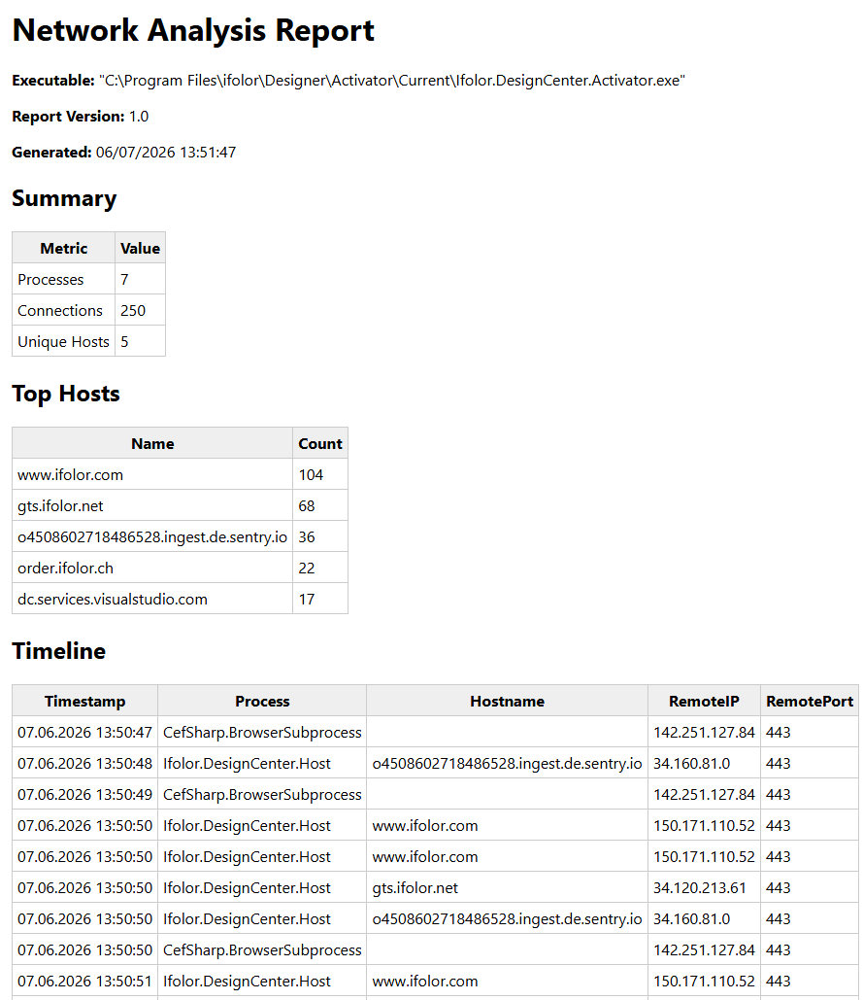

# Network Application Analyzer

PowerShell based application network analysis framework for Windows applications.

The tool automatically:

- launches an application
- tracks child processes recursively
- collects TCP/UDP connections
- correlates DNS cache entries
- builds hostname mappings
- generates proxy allow lists
- creates HTML and CSV reports

## Features

- Recursive process tracking
- DNS hostname correlation
- Proxy allow list generation
- HTML reporting
- CSV export
- Optional Procmon integration
- No packet capture required

## Requirements

- Windows Windows 11
- PowerShell 5.1
- Local Administrator

Optional:

- Procmon64.exe

## Example

```powershell
.\NetworkApplicationAnalyzer.ps1 `
    -Executable "C:\Program Files\Bambu Studio\bambu-studio.exe" `
    -Arguments "" ` 
    -DurationSeconds 60 `
    -PollingIntervalSeconds 2 `
    -EnableProcmon # Procmon is optional and not required for network analysis.
```
    
## Output

Reports are generated under:

```text
Reports\yyyyMMdd_HHmmss
```

Generated files:

- Report.html
- CombinedReport.csv
- Connections.csv
- DnsCache.csv
- Proxy-AllowList.txt
- Proxy-AllowList-Wildcards.txt

## Sample Report



## Procmon Support

The analyzer works without Procmon by default.

If Procmon64.exe is available in the project root, additional process activity can be collected.

Procmon is optional and not required for network analysis.

## Use Cases

- Application onboarding
- Proxy whitelisting
- Firewall rule creation
- Software packaging validation
- Network dependency analysis
- Security reviews

## License

MIT License